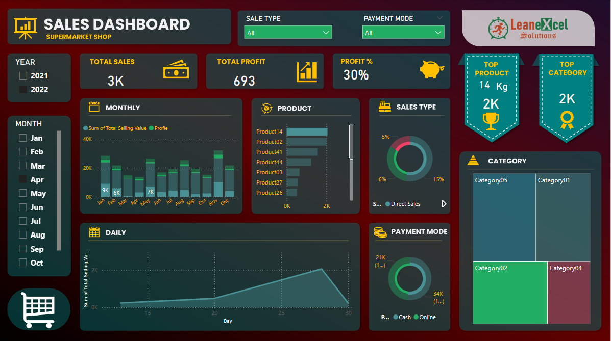

# 📈 Sales Dashboard

A Power BI dashboard that visualizes key sales metrics across sale type, time periods, and product categories.

## Overview

This dashboard helps stakeholders understand:

- Revenue trends over time
- Top-selling products and categories
- Sale-type performance breakdown
- Profitability insights

## Features

- Dynamic filters by date, sale-type, and category
- KPIs: Total Sales, Profit, Units Sold
- Line and bar charts for trend analysis

## Files

- `sales_dashboard.pbix` – Power BI report
- `data/sales_data.csv` – Sample dataset

## Preview

---

